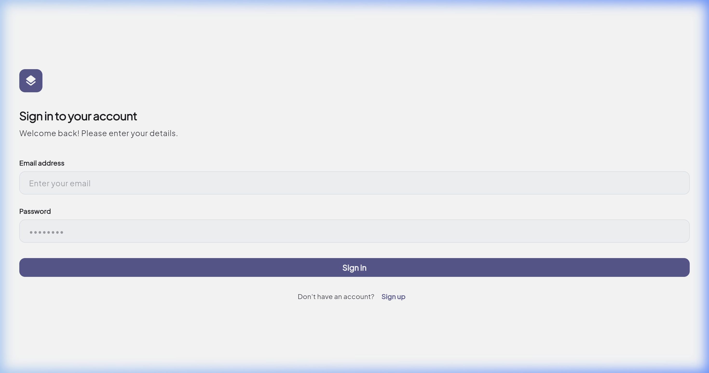
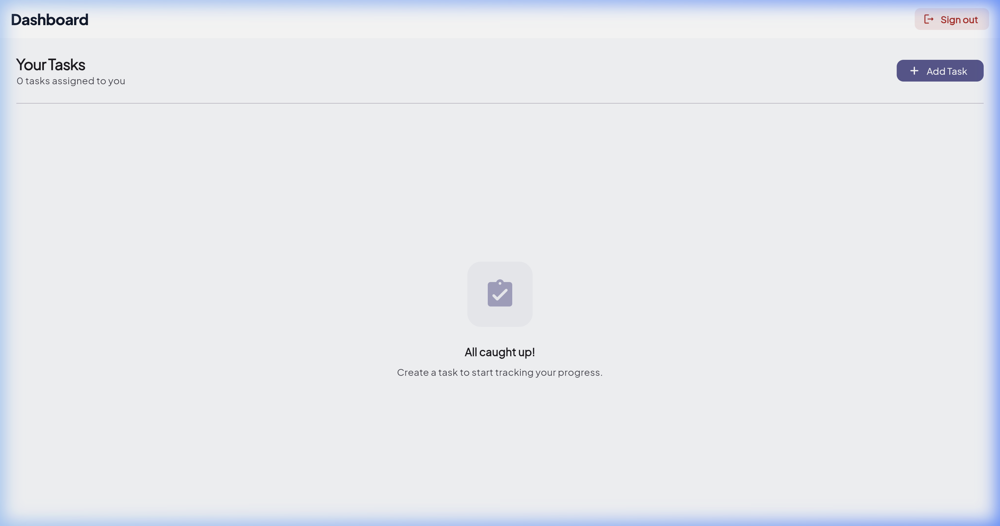
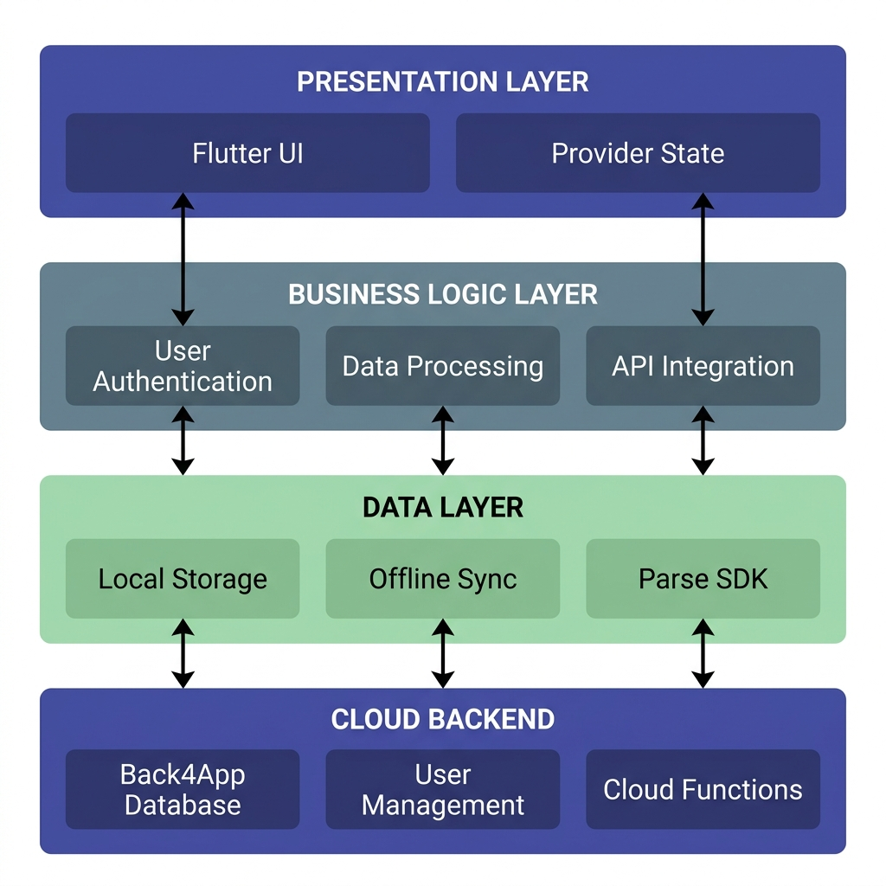

# Task Manager App 🚀

A premium, enterprise-grade Task Management application built with **Flutter** and integrated with **Back4App (BaaS)**. This project demonstrates a full-stack cross-platform application with secure authentication, real-time data synchronization, and a professional SaaS aesthetic.

## 🌟 Key Features

- **Professional UI/UX**: Clean, minimal design using a Slate/Indigo palette and Material 3.
- **Secure Authentication**: Register and Login using Parse-based authentication.
- **Full CRUD Operations**: Create, Read, Update, and Delete tasks with instant cloud syncing.
- **Real-time Persistence**: Data is stored securely in the Back4App cloud database.
- **Dashboard Overview**: Summary of active tasks and completion status.
- **Responsive Design**: Optimized for multiple screen sizes with support for Light and Dark modes.

## 📸 Screenshots

| Login Screen | Dashboard |
| :---: | :---: |
|  |  |

## 🎥 Video Demo

Check out the full application walkthrough on YouTube:
[](https://youtu.be/b2aR0JLoSPo)

## 🏗️ Architecture

The application follows a clean, layered architecture to ensure scalability and maintainability:



1.  **Presentation Layer**: Flutter UI with Material 3.
2.  **State Management**: Provider (ChangeNotifier) pattern.
3.  **Data Layer**: Parse SDK for backend communication.
4.  **Cloud Backend**: Back4App (MongoDB + Parse Server).

## 🛠️ Technology Stack

- **Frontend**: [Flutter](https://flutter.dev) (Dart)
- **Backend**: [Back4App](https://www.back4app.com) (BaaS)
- **State Management**: [Provider](https://pub.dev/packages/provider)
- **Fonts**: Plus Jakarta Sans (via Google Fonts)

## 🚀 Getting Started

### Prerequisites
- Flutter SDK installed on your machine.
- A Back4App account and App credentials.

### Setup
1.  **Clone the repository**:
    ```bash
    git clone https://github.com/vm-pranavan/CrossPlatformAssignment.git
    cd CrossPlatformAssignment
    ```

2.  **Install dependencies**:
    ```bash
    flutter pub get
    ```

3.  **Configure Backend**:
    Open `lib/core/constants.dart` and add your Back4App credentials:
    ```dart
    static const String keyApplicationId = 'YOUR_APP_ID';
    static const String keyClientKey = 'YOUR_CLIENT_KEY';
    ```

4.  **Run the application**:
    ```bash
    flutter run -d chrome
    ```

## 📝 Learning Objectives
- Integrating Backend-as-a-Service (BaaS) with mobile apps.
- Implementing secure user sessions and real-time data sync.
- Designing professional, production-ready interfaces in Flutter.

---
Developed for the **Cross-Platform Application Development** assignment.
