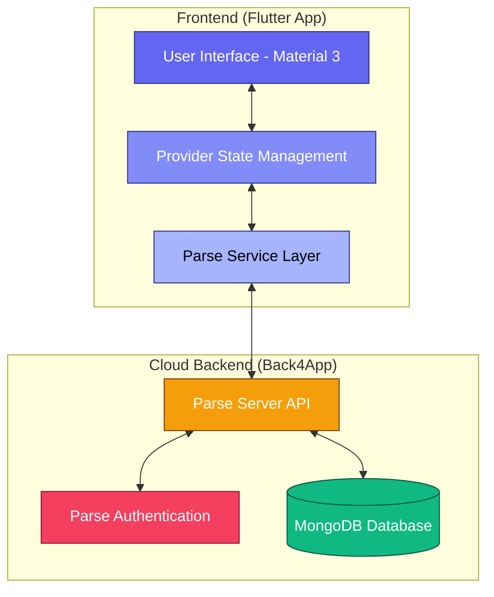

# Task Manager App Architecture

## Description of Components

### 1. User Interface (Flutter)
Built using **Flutter** and **Material 3**, the UI provides a professional dashboard and authentication screens. It is designed with a Slate/Indigo palette for an enterprise SaaS feel.

### 2. State Management (Provider)
Uses the **Provider** pattern to manage application state (Auth status, Task lists). This ensures that UI components update automatically when data changes.

### 3. Parse Service Layer
A dedicated service layer that interacts with the **Parse Server SDK**. It handles the transformation of local data models into Parse Objects and vice versa.

### 4. Back4App Backend
A Backend-as-a-Service (BaaS) that manages:
*   **Authentication**: Secure user login and registration.
*   **Database**: A hosted MongoDB for storing and retrieving tasks in real-time.
*   **Server**: The Parse Server API that acts as the bridge between Flutter and the database.
