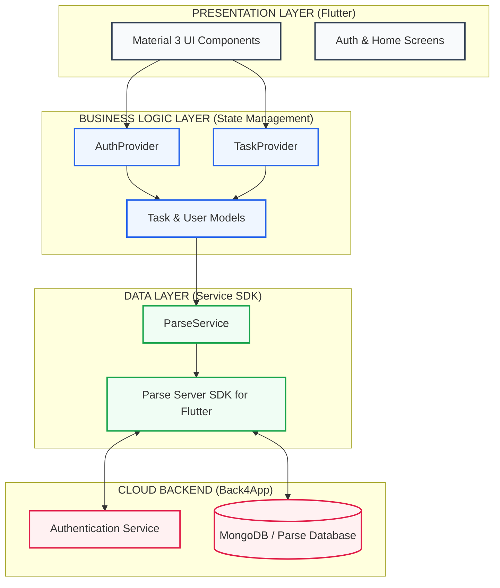

# Technical Block Architecture Diagram

## Layer Breakdown

### 1. Presentation Layer
*   **Purpose**: User interaction and data display.
*   **Tools**: Flutter Material 3, Custom SaaS Widgets.

### 2. Business Logic Layer
*   **Purpose**: State management and business rules.
*   **Tools**: Provider (ChangeNotifier), Data Models.

### 3. Data Layer
*   **Purpose**: Communication with external APIs.
*   **Tools**: Parse Server SDK, ParseService abstraction.

### 4. Cloud Backend
*   **Purpose**: Persistent storage and security.
*   **Tools**: Back4App (Auth, NoSQL Database).
